# ☘️ Obolus :: Private Perpetual & Spot DEX

**The first sub-second, privacy-preserving institutional DEX on Starknet.**

Powered by **Starknet** + **Tongo (ElGamal Encryption)** + **Garaga/SnarkJS ZK-Proofs** + **Pyth Hermes**.

---

## 🛡️ Privacy as a Feature

In traditional DEXs, every position is public, leaving traders vulnerable to copy-trading, front-running, and MEV extraction. 

Obolus implements a **Hybrid Privacy Model** to shield your financial footprint:
- **Sealed Positions:** Order sizes, entry prices, and leverage are stored entirely as ciphertexts on-chain.
- **Zero-Knowledge Validity:** Traders prove they have sufficient margin *without* revealing the trade size.
- **Viewing Keys:** Selective disclosure endpoints designed for regulatory compliance, letting auditors see what they need without exposing data to the public.

---

## 🏗️ Technical Architecture

Obolus marries **Homomorphic Encryption** (manipulating ciphertext directly) with **Zero Knowledge Proofs** (verifying truth without revealing data) to create an institutional-grade dark pool on Starknet.

### 🧩 The Protocol Stack

```mermaid
graph TD
    classDef frontend fill:#1e1e2d,stroke:#E44134,stroke-width:2px,color:#fff;
    classDef zk fill:#2d1e1e,stroke:#E44134,stroke-width:2px,color:#fff;
    classDef starknet fill:#1e2d24,stroke:#4caf50,stroke-width:2px,color:#fff;
    
    subgraph Client [Browser / Frontend]
        UI[Obolus Terminal\nNext.js / React]:::frontend
        ElGamal[Tongo SDK\nElGamal Encryption]:::zk
        Prover[SnarkJS WASM\nGroth16 Prover]:::zk
    end

    subgraph Validators [Decentralized Oracle]
        Pyth[Pyth Hermes\nmillisecond-level prices]:::frontend
    end

    subgraph Blockchain [Starknet Smart Contracts]
        DEX[Obolus DEX\nPerp & Spot Logic]:::starknet
        Garaga[Garaga Verifier\nOn-Chain Math]:::starknet
    end

    UI -->|1. Plaintext Trade| ElGamal
    UI -->|1. Plaintext Trade| Prover
    Pyth -.->|Real-time Price| UI
    
    ElGamal -->|2. Encrypted (L, R) Cipher points| DEX
    Prover -->|3. proof.json Payload| Garaga
    
    Garaga -->|4. True / False| DEX
    DEX -->|5. State Updated Homomorphically| DEX
```

---

## 🔄 The Trade Lifecycle

How does a fully private trade execute in sub-seconds?

```mermaid
sequenceDiagram
    participant User
    participant Browser as Obolus Frontend
    participant Pyth as Pyth Network
    participant Contract as Starknet DEX
    participant Garaga as Garaga Verifier

    User->>Browser: Enters Size & Price
    Browser->>Pyth: Fetch live market data
    
    rect rgb(20, 30, 40)
        Note over Browser: Client-Side Cryptography Phase
        Browser->>Browser: Tongo SDK Encrypts Size -> (L, R) points
        Browser->>Browser: SnarkJS WASM Generates Groth16 Proof
    end

    Browser->>Contract: Invoke `open_position_sealed(encrypted_size, ZK_proof)`
    
    rect rgb(30, 40, 30)
        Note over Contract,Garaga: On-Chain Processing Phase
        Contract->>Garaga: Verify Groth16 Proof Calldata
        Garaga-->>Contract: Returns Valid = True
        Contract->>Contract: Store Homomorphic Ciphertext in State
    end
    
    Contract-->>Browser: Transaction Confirmed
    Browser-->>User: Trade Active (100% Private)
```



---

## 🚀 Implementation Status (Hackathon Build)

### ⛓️ Smart Contracts (Cairo 2.x Workspace)
- [x] **Workspace Isolation**: Standalone `dex` and `verifier` packages to prevent compiler locking.
- [x] **ObolusPerp**: Sealed perpetual engine using ElGamal position storage.
- [x] **Garaga ZK Verifier**: Groth16 verification endpoints validating SNARKs directly on Starknet.
- [x] **ObolusOracle**: On-chain price feed integration ready for settlement.

### 🎨 Frontend (Next.js)
- [x] **Pro-Exchange UI**: Dark-mode, high-fidelity TradingView integrated dashboard.
- [x] **Dual Markets**: Comprehensive `/perp` and `/spot` trading environments.
- [x] **In-Browser Prover**: SnarkJS generating real `.wasm`/`.zkey` Groth16 proofs seamlessly inside the React client.
- [x] **Tongo SDK Integration**: Real ElGamal encryption pipelined through deterministic Starknet login keys.
- [x] **Real-time Oracle Sentinel**: Pyth Hermes driving millisecond-level price attestations.
- [x] **Selective Disclosure**: Functional "Auditor" flow for regulatory compliance.

---

## 🚀 Getting Started

To run the Obolus development environment locally:

### 1. Install Dependencies
```bash
npm install
# Note: snarkjs will run a post-install script for wasm browser support
```

### 2. Run the Development Server
```bash
npm run dev
```

Open [http://localhost:3000](http://localhost:3000) with your browser to see the result.

### 3. Smart Contracts (Optional)
The smart contracts are located in the `obolus-contracts-stark-v2` workspace. To build them:
```bash
cd ../obolus-contracts-stark-v2
scarb build -p obolus
scarb build -p verifier
```

---

## 📚 Resources
- [Starknet Architecture](https://starknet.io/)
- [Tongo SDK (Cipher Operations)](https://github.com/fatsolutions/tongo-sdk)
- [Garaga (On-chain ZK Verification)](https://github.com/keep-starknet-strange/garaga)
- [SnarkJS (Off-chain Proof Generation)](https://github.com/iden3/snarkjs)
- [Pyth Network (Oracles)](https://pyth.network/)
